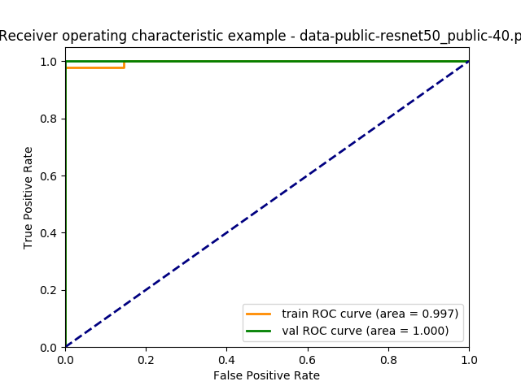
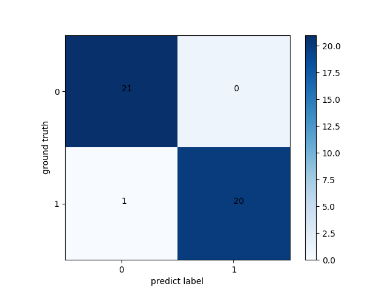

# Lungs X-ray Chest Classification(COVID-19 or Other pneumonia)

    This project uses a convolutional neural network to build a classifier to determine whether a patient's pneumonia is due to neocoronavirus or other types of pneumonia. The data set is described below.

## Structure

    .
    |-- main.py                     # train model
    |-- utils.py                    # define modules
    |-- data
    |   |-- public
    |   |   |-- train
    |   |   |   |-- positive
    |   |   |   |-- negative
    |   |   |-- val
    |   |   |   |-- positive
    |   |   |   |-- negative
    |-- model
    |   |-- resnet50_public-40.pth  # saved model

## Dataset

* [Kaggle Dataset](https://www.kaggle.com/paultimothymooney/chest-xray-pneumonia)
  
    The dataset is organized into 3 folders (train, test, val) and contains subfolders for each image category (Pneumonia/Normal). There are 5,863 X-Ray images (JPEG) and 2 categories (Pneumonia/Normal). Chest X-ray images (anterior-posterior) were selected from retrospective cohorts of pediatric patients of one to five years old from Guangzhou Women and Children’s Medical Center, Guangzhou. All chest X-ray imaging was performed as part of patients’ routine clinical care.

* [Github Dataset](https://github.com/ieee8023/covid-chestxray-dataset)
  
  This project extract images from publications.

## Details

### Datasets description

|       |COVID-19   |Others   |
|-------|-----------|---------|
|train  |48         |48       |
|val    |21         |21       |

### Lab environment

* Hygon C86 7185 CPU
* Pre-Wukong DCU
* 128GB RAM

### Result

|           |ACC    |AUC    |SEN    |F1     |
|-----------|-------|-------|-------|-------|
|train      |0.9792 |0.9970 |0.9792 |0.9792 |
|val        |0.9762 |1.0    |0.9524 |0.9756 |

### ROC

